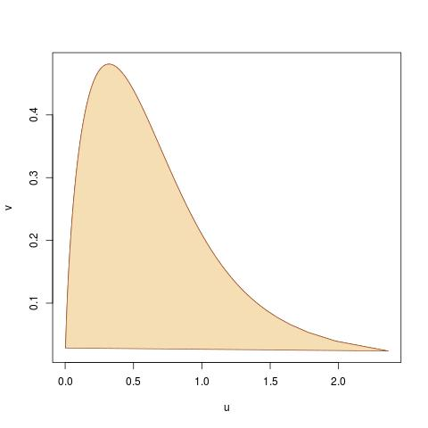
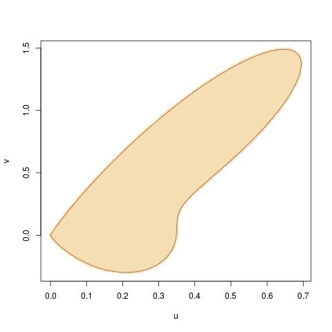
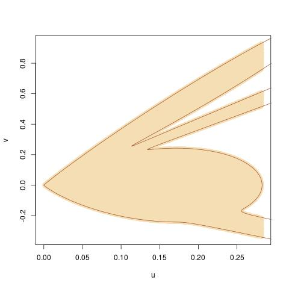

```{r setup, include=FALSE}
library(computoR)
knitr::opts_chunk$set(
  screenshot.force = FALSE, 
  echo = FALSE,
  message = FALSE, 
  warning = FALSE)
```

## Core 

A specific approach to random number generation @devroye1986 that follows from the fundamental lemma of simulation @robertcasella2004 is
the ratio-of-uniform method @kindermanmonahanramage1977. It is used for the simulation of many standard distributions. This method is a rejection sampling scheme which can be calibrated to produce a high acceptance rate using only simple (e.g., Uniform) proposals. See for instance the case of the $t$ and Gamma distributions @chengfeast1979. The method is based on the observation that the uniform distribution on the set
$$
\mathfrak{A} = \left\{(u; v)\in \mathbb{R}^+\times\mathfrak{X};\ 0\le u^2  \le f(v/u) \right\}\,,
$$
where $\mathfrak{X}$ is the state space of the target distribution, induces a marginal distribution with density proportional to $f$ for the random
variable $V=U$. The name of the method follows directly this interpolation. The proof of this result is a straightforward application of the transform
method, since, if $(U,V)\sim\mathcal{U}(\mathfrak A)$, then the density of $(W,X)=(U^2,V/U)$ is
$$
\tilde{f}(w,x)\propto\mathbb{I}_A(w^{\frac{1}{2}},w^{\frac{1}{2}}x)\times w^{\frac{1}{2}}\times\dfrac{1}{2w^{\frac{1}{2}}}
\propto\mathbb{I}_{0\le w\le f(x)}
$$
As mentioned already, this is therefore a consequence of the fundamental lemma of simulation, since we recover the uniform distribution on the set
$$
\mathfrak{B} = \left\{(u; v)\in \mathbb{R}^+\times\mathfrak{X};\ 0\le u  \le f(v) \right\}
$$
which clearly induces the marginal distribution with density proportional to $f$ on $V$. While there is thus no mathematical issue with the marginalisation result behind the ratio-of-uniform method, it is much less straightforward to picture the construction of efficient random number generators based on this principle, when compared with the fundamental lemma.

```{r A0, fig.align='center',  fig.show='hold', fig.cap="Representation of the ratio-ofuniform set $\\mathfrak A$ for the Normal $\\text{N}(0,1)$ and the Gamma $\\text{Ga}(\\frac{1}{2},1)$ distributions."}

```

The first difficulty is to determine the shape of the set $\mathfrak{A}$, for which there is little intuition if any. Figure \@ref(fig:A0) displays the resulting sets $\mathfrak A$ for the Normal $\text{N}(0,1)$ and the Gamma $\text{Ga}(\frac{1}{2},1)$ distributions. The later is unbounded in $u$, due to the asymptote of the density $f$ at $x=0$. In the general case, the boundary of the set $\mathfrak{A}$ is given by the parametric curve @devroye1986
$$
u(x) = \sqrt{f(x)},\ v(x) = x \sqrt{f(x)},\ x\in\mathfrak X\,.
$$
In the event where $\mathfrak{X}\subset \mathbb{R}$ and both $f(x)$ and $x^2f(x)$ are bounded over $\mathfrak{X}$, it is formally possible to create a cube in $\mathbb{R}^+\times\mathfrak{X}$ around $\mathfrak A$ and to deduce an accept-reject strategy, based on uniform simulations in that cube. Using a two component normal mixture as a benchmark, the following pictures (Figures \@ref(fig:A1) and \@ref(fig:A2) show that the set $\mathfrak A$ is then bounded, albeit quite sparse in the cube that contains it. This implies that the ratio-of-uniform method would not be efficient in that situation.

As pointed out @devroye1986, since a simulation from $f$ can also be derived by uniform simulations on sets like
$$
\mathfrak C= \left\{(u; v)\in \mathbb{R}^+\times\mathfrak{X};\ 0\le u  \le f(u+v) \right\}
$$
with a marginalisation in $U + V$, or
$$
\mathfrak D= \left\{(u; v)\in \mathbb{R}^+\times\mathfrak{X};\ 0\le u^2  \le f(v/\sqrt{u})^3 \right\}
$$
with a marginalisation in $V/\sqrt{U}$. As we will now demonstrate, there exists a generic construction of such sets. However, it seems impossible to rank those sets
in terms of efficiency in the general case. (This comparison only stands under the assumption that all relevant functions are properly bounded to allow for bound-
ing boxes.) Even without seeking a bounding box and the associated uniform distribution on that set, it seems delicate to compare slice samplers on the three
sets $\mathfrak A$, $\mathfrak C$, $\mathfrak D$, and their generalisations.

```{r A1, fig.align='center',  fig.show='hold', fig.cap="Set $\\mathfrak A$ for a two component Normal mixture."}

```

```{r A2, fig.align='center',  fig.show='hold', fig.cap="Set $\\mathfrak A$ for a four component Normal mixture."}

```

## Extension 

There exists a generic family of transforms that generalises the original ratio-of- uniform method. Namely, considering a differentiable monotone function $h$ over
the positive half-line, $\mathbb{R}^+$, the uniform distribution over the set
$$
\mathfrak H = \left\{(u; v)\in \mathbb{R}^+\times\mathfrak{X};\ 0\le u  \le h\circ f(v/g(u)) \right\}
$$
induces the right marginal $f$ on the ratio $V/g(U)$ if the primitive $G$ of $g$ is the inverse of $h$, i.e., $G\circ h(x) = x$. The proof is rather straightforward.
Considering the change of variable from $(u,v)$ to $(u,x)=(u,v/g(u))$ produces a Jacobian of $g(u)$ and a joint density
$$
U,X \sim \mathbb{I}_{0\le u\le h\circ f(x)}(u,x)\,g(u)
$$
which integrates into
$$
X \sim \int_0^{h\circ f(x)} g(u)\,\text{d}u = G\circ h\circ f(x) = f(x)
$$
when $G\circ f =\text{id}$. The corresponding boundary of $\mathfrak H$ is then provided by the parameterised curve
$$
u(x)= h\circ f(x),\ v(x)=x(g\circ h\circ f)(x),\ x\in\mathfrak X\,.
$$
For instance, when $h(x)=x^a$, a power transform, the boundary can be written as
$$
u(x)=f(x)^a,\ v(x)=x f(x)^{1-a},\ x\in\mathfrak X\,.
$$
Similarly, when $h(x)=\exp(x)$, the ratio-of-uniform set is defined as
$$
\mathfrak H = \left\{(u; v)\in \mathbb{R}^+\times\mathfrak{X};\ 1\le u  \le \exp\{f(vu)\} \right\}
$$
with the curve
$$
u(x)=\exp\{f(x)\},\ v(x)=x\,\exp\{-f(x)\},\ x\in\mathfrak X\,.
$$
Note the change of range for $u$ in that case.

An appeal of this generalisation is the formal possibility to include unbounded densities and still produce compact boxes, as this seems essential for
accept-reject simulation if not for slice sampling. One possible choice for $h$ is the generalised logistic transform
$$
h(\omega) = \dfrac{\omega^a}{1+\omega^a} 
$$
which ensures that the [ratio-of-almost-uniform] set $\mathfrak H$ is bounded in $u$. Since the transform $g$ is the derivative of the inverse of $h$,
$$
g(y) =\dfrac{a^{-1}y^{(1-a)/a}}{(1-y)^{(1+a)/a}}.
$$
the parametrisation of the boundary of $\mathfrak H$ is
$$
u(x) = \dfrac{f(x)^a}{(1 + f(x))^a},\ v(x) = a^{-1}xf(x)^{a-1}(1 + f(x))^{-2} \left[
(1+f(x)^a-f(x)^a\right]^{-\frac{1+a}{a}}\,
$$
which means $\mathfrak H$ remains bounded if (a) $a\le 1$^[to ensure boundedness at infinity]
and (b) the limit of $v(x)$ at zero [where the asymptote of $f$ must stand] is bounded. This is satisfied if
$$
\lim_{x\to 0} xf(x)^{\frac{a+1}{a}} < +\infty\,.
$$
For instance, this constraint holds for Gamma distributions with shape parameter larger than $\frac{1}{2}$.

However, resorting to an arbitrary cdf $\Phi$ instead of the generalised logistic cdf solves the difficulty for most distributions, including all Gamma
distributions. (Note that the power $a$ is superfluous since $\Phi^a$ is also a cdf.  Nonetheless, using this representation  brings an easier calibration of the
proposal.) Indeed, the relevant set is now
$$
\mathfrak H = \left\{(u; v)\in \mathbb{R}^+\times\mathfrak{X};\ 0\le u  \le \Phi(f(v/g(u)))^a \right\}
$$
while the boundary of $\mathfrak H$ is
$$
u(x) =\Phi(f(x))^a,\  v(x) = a^{-1}xf(x)^{\frac{1-a}{a}}/\varphi\circ f(x),\ x\in\mathfrak X\,,
$$
when $\varphi$ is the derivative of $\Phi$. This can be seen from $G(u)=\Phi^{-1}(u^{\frac{1}{a}})$ and
$$
g(u)=a^{-1}u^{\frac{1-a}{a}}\big/ \varphi(\Phi^{-1}(u^{\frac{1}{a}}))
$$
which implies that
$$
g(u(x))=a^{-1}f(x)^{\frac{1-a}{a}}\big/ \varphi(\Phi^{-1}(\Phi(f(x))))\,.
$$
This result means that the set remains bounded if $\varphi$ has heavy enough tails, like $x^{-2}$, to handle the explosion at $x = 0$. Obviously, the
density $\varphi$ must further enjoy an asymptote at zero to handle the limit at infinity when $f(x)$ goes to zero.

For instance, consider the case when $a=1$, meaning the boundary of $\mathfrak H$ is
$$
u(x) =\Phi(f(x)),\  v(x) = 1/\varphi\circ f(x),
$$
and assume $f(x)\equiv x^{-\epsilon}$ at $x=0$ and $\varphi(y)\equiv y^{-\alpha-1}$ at $y=+\infty$. At $x=0$ we then have $v(x)\equiv x^{1-\epsilon(\alpha+1)}$, which is a positive power for $\alpha$ small enough. Furthermore, if $f(x)\equiv x^{-\delta-1}$ at $x=\infty$ and $\varphi(y)\equiv y^{-\beta}$ at $y=0$, then at $x=+\infty$, we have $v(x)\equiv x^{1-\beta(\delta+1)}$, which is a negative power for $\beta$ close enough to $1$.
However, this type of tail behaviour in $\Phi$ is not sufficient to handle a Gamma distribution $\text{Ga}(1-\epsilon,1)$ $(0<\epsilon<1)$ since the
exponential term is dominant at $\infty$. Take thus a transform such that $\phi(x)$ is equivalent to $\log\{\frac{1}{x}\}^b$ $(b>0)$ near zero. Then, at $\infty$
$$\frac{x}{\varphi\circ f(x)} \equiv x \left\{(-(1-\epsilon)\log(x)+x\right\}^{-b}\equiv x^{1-b}$$
which remains bounded when $b>1$, as for instance $b=2$. The behaviour of $\frac{x}{\varphi\circ f(x)}$ is easier to manage since $f$ is then equivalent to $x^{1-\epsilon}$. If the tail behaviour of $\varphi$ at infinity is polynomial, i.e., $\varphi(y)\equiv y^{-1-\nu}$, we get 
$$\frac{x}{\varphi\circ f(x)} \equiv x \left\{x^{-1+\epsilon}\right\}^{-(1+\nu)}\equiv x^{1-(1-\epsilon)(1+\nu)}$$
at infinity, which remains bounded when $(1-\epsilon)(1+\nu)<1$, i.e., $\nu<\frac{\epsilon}{1-\epsilon}$. For practical purposes, we consider the mixture density $0<\gamma<1)$
$$\varphi(x)=\gamma\dfrac{2\,\log(x)^2}{1+(1+\log(2))^2}\mathbb{I}_{(0,\frac{1}{2})}(x)+
(1-\gamma)\dfrac{\nu\{\frac{3}{2}\}^\nu}{(1+x)^{\nu+1}}\mathbb{I}_{(0,\frac{1}{2})^c}(x)$$
which is normalised, continuous at $x=\frac{1}{2}$ when
$$\gamma=\dfrac{1}{1+\frac{3\nu\log(2)^2}{1+(1+\log(2))^2}}$$
and associated with the cdf
$$\Phi(x)=\gamma\dfrac{2x[(1-\log(x))^2+1]}{1+(1+\log(2))^2}\mathbb{I}_{(0,\frac{1}{2})}(x)+
  \left\{\gamma+(1-\gamma)\left[1-\dfrac{(3/2)^{\nu}}{(1+x)^{\nu}}\right]\right\}\mathbb{I}_{(0,\frac{1}{2})^c}(x)$$

Figure \@ref(fig:G1) produces three different bounded sets for $\text{Ga}(\alpha,1)$ distributions based on the above mixture
transform $\Phi$.

```{r G1, fig.align='center', layout = 'l-body', fig.show='hold', out.height = '50%', fig.cap="Set $\\mathfrak H$ for $\\text{Ga}(0.1,1)$ target; (b) $\\text{Ga}(0.5,1)$ target; (c) $\\text{Ga}(0.9,1)$ target, when $\\nu=.9\\epsilon/(1-\\epsilon)$."}
knitr::include_graphics(c("figs/ratgamp1.png", 
                          "figs/ratgamp5.png",
                          "figs/ratgamp9.png"))
```

Obviously, given the shape of those sets, using a rectangular box does not lead to an efficient simulation algorithm. (This goes without mentioning that a $\text{Ga}(1-\epsilon,1)$ distribution can be derived from a $\text{Ga}(2-\epsilon,1)$ by multiplying a simulation from the former by $U^{\frac{-1}{1-\epsilon}}$.)


